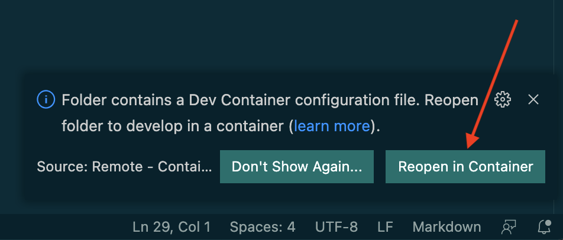

# Processing Tools

A collection of tools to facilitate document processing:

- `/browserless/convert/` => To convert an html file to pdf using browserless.
- `/wkhtmltopdf/convert/` => To convert an html file to pdf using wkhtmltopdf.
- `/od_to_pdf/` => to convert any open document format file to pdf using libreoffice. Supported file formats include: odt, odp, ods, odg etc. It also supports all the Office Open XML specification from docx, pptx and xlsx

## Development

To install and run via Docker Compose:

Intel CPU:

Mac M1

```shell
docker-compose up
```

AMD64 architecture

```shell
TARGETARCH=amd64 docker-compose up
```

To run the tests:

```shell
docker-compose run ptools poetry run pytest
```

## Development with VSCode & Docker

If you use VSCode, you can develop this project in a devcontainer. To do
so, you simply need to click the following button that will (or should) appear in the bottom right of the editor when you open this project in VSCode:



## Configuration

The following environment variables can be set:

- `$BROWSERLESS_SERVER_ENDPOINT`: By default it's pointing to http://browserless on port 3000.
